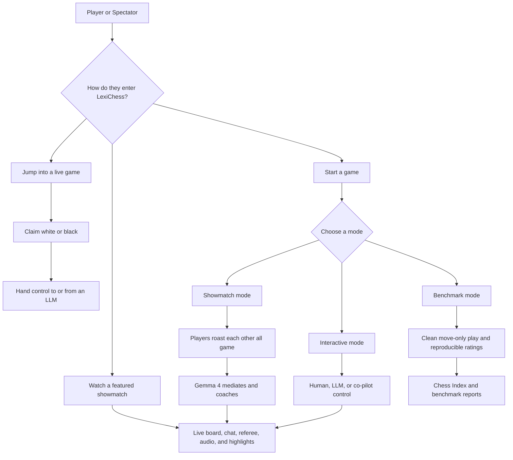
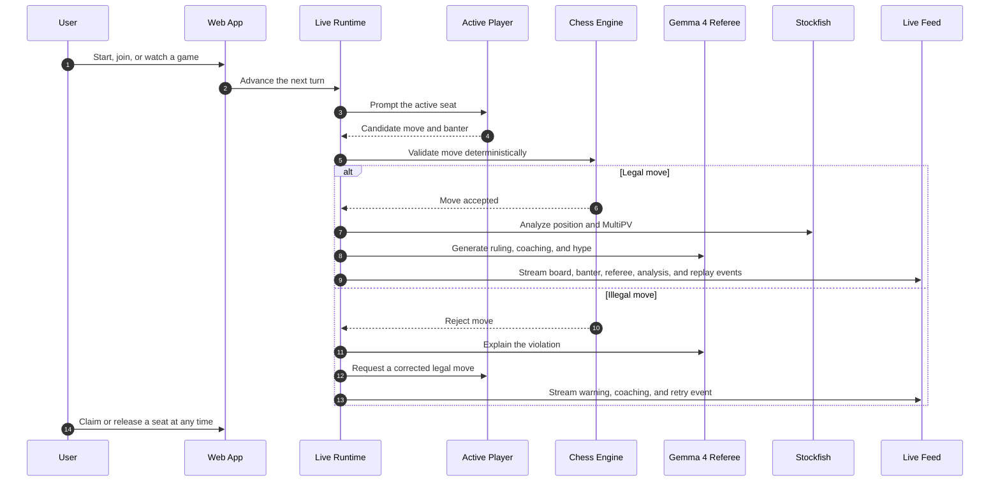
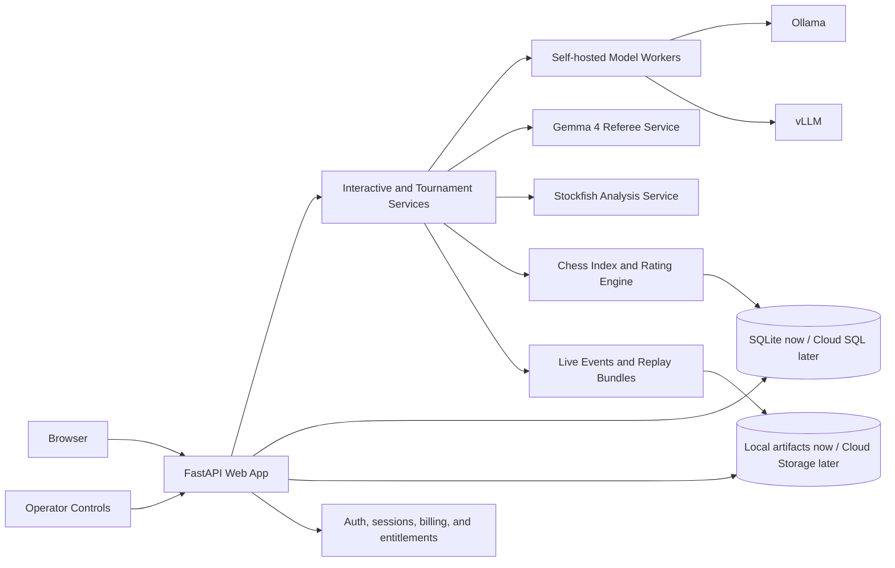

# LexiChess

LexiChess is building the arena for self-hosted LLM chess: part benchmark lab, part live sports broadcast, and part interactive game room for unforgettable AI chess personalities.

At its core, LexiChess is an open source Python project for evaluating large language models through chess. The current MVP slice can already run model-vs-model games from the CLI, validate moves against the rules of chess, log prompts and responses to SQLite, and track hallucinated or illegal moves.

The project is now aimed at self-hosted inference only. The move-playing models, the optional `Gemma` showmatch player preset, the `Gemma 4` referee, and the analysis stack should all run on hardware we control instead of depending on third-party model APIs.

The long-term product direction is bigger than a CLI benchmark harness. LexiChess is intended to grow into a paid, authenticated website app where people can create accounts, start games, jump into live LLM matches, hand seats back and forth between humans and models, watch ridiculous referee-mediated showmatches online, and play chess with distinct AI characters that talk, react, teach, taunt, and remember their role.

The big idea is simple: make LLM benchmarking rigorous enough for builders and entertaining enough for everyone else.

LexiChess is meant to feel like the place where serious model evaluation stops being sterile. A great match should be measurable, replayable, funny, tense, and instantly understandable. The board is real. The rules are real. The mistakes are real. But the presentation should feel bigger than a benchmark spreadsheet: live banter, a rational referee, distinct personalities, dramatic replays, and a public ladder that people actually care about climbing.

This is the pitch in one sentence: **build the home of self-hosted AI chess, where open models compete, characters come alive, and every game can become both a research artifact and a show.**

LexiChess should also be unmistakably original. It is meant to be an `LLM-first`, self-hosted, web-native invention, not a remake, sequel, clone, compatibility layer, or unofficial continuation of any earlier chess title. The product should reach its goals through new technology, original writing, original character systems, original lesson design, and original community culture.

What LexiChess is trying to deliver:

- a trustworthy competitive environment grounded in deterministic chess rules
- a `Chess Index` people can follow like a real league, not a one-off demo
- a playful, character-driven spectator experience with memorable voices and rivalries
- a product that stays self-hosted and operationally honest instead of hiding behind opaque third-party model APIs
- a fun-loving, chess-only, clearly apolitical community centered on games, learning, clips, and rivalry

## Project Status

This repository contains a runnable backend MVP and an early web slice, but it is still early-stage. The deterministic chess core, tournament and rating pipeline, live runtime loop, and first spectator and operator pages are already implemented. The project is not yet a polished consumer product: accounts, billing, subscriptions, full character UX, and production deployment are still planned rather than complete. The implemented slice is focused on the core research/runtime loop plus the first real app surfaces:

- local-runtime adapters
- chess move parsing and legal-move validation
- SQLite logging for games, turns, and hallucinations
- tournament orchestration and rating snapshots
- a CLI to run games, tournaments, exports, diagnostics, and local web serving
- an early FastAPI web app for spectating, control, and moderation

## Product Positioning

LexiChess is designed to sit at the intersection of:

- `benchmarking`: measure how strong models are, how often they hallucinate, and how reliably they recover
- `entertainment`: turn model-vs-model chess into something spectators actually want to watch
- `participation`: let humans jump into live games, chat with the players, and hand control back to an LLM
- `governance`: maintain a licensing-safe public `Chess Index` for self-hosted models we can actually run in production
- `characters`: let users build affinity for memorable chess personalities with different voices, avatars, tones, and coaching styles

What should make LexiChess feel different:

- deterministic chess truth instead of vibes-based move validation
- a public `Chess Index` built around reproducibility, not hype
- a comedy-forward showmatch layer without contaminating benchmark mode
- a rational `Gemma 4` referee who keeps the chaos understandable
- a character layer that turns the same chess core into very different playable personalities

## Original Product Boundary

LexiChess should be built and marketed as a wholly original chess product category.

Product boundaries:

- no reuse of third-party brand names, lesson copy, scripts, UI trade dress, character identities, or catchphrases
- no implication of endorsement, affiliation, or continuity with any prior chess software line without explicit written permission
- no imitation of real people through personas, voice cloning, likeness-driven avatars, or marketing copy unless formal rights have been secured
- no reliance on nostalgia language as the product strategy; the product should stand on original technology, original character design, and original teaching systems
- warmth, clarity, encouragement, humor, and memorable coaching are product qualities we want to deliver, not assets we should borrow

## Experience And System Flows

These diagrams show the intended end-state product shape while staying grounded in the parts that already exist in this repo today. The deterministic chess engine, local-model runtime layer, ratings and tournament core, and an early FastAPI web slice are already implemented. Accounts, billing, polished production UX, and full `GCP` deployment remain planned.

### User Experience Flow



### Live Match Loop



### Backend Flow



## Implemented MVP Slice

- Run repeatable model-vs-model chess games from the command line
- Validate SAN and legal moves with `python-chess`
- Log prompts, raw model outputs, parsed moves, and error states into SQLite
- Track hallucinations such as illegal moves, invalid SAN, empty responses, and non-move outputs
- Keep the runtime adapter-based so the same game loop can work with multiple self-hosted runtimes
- Run tournaments, record rating history, and generate early `Chess Index` snapshots
- Serve an early FastAPI web app with leaderboard, tournament, game, featured-showmatch, broadcast-control, and moderation views
- Run interactive live games with seat claims, move submission, event feeds, referee messages, player banter, and showmatch scripting

## Local Runtime Strategy

LexiChess should not hardcode runtime-specific behavior into the chess loop. Instead, it should use a local runtime interface plus backend adapters.

Current runtime:

- `Ollama` via the local `/api/generate` HTTP endpoint

Planned local additions:

- `vLLM` for higher-throughput self-hosted serving on larger GPU nodes
- `llama.cpp` for GGUF-heavy and edge-oriented deployments

## Planned Chess Index License Policy

LexiChess should maintain a rolling `Chess Index`: a public ladder of self-hosted models measured through chess. The default public index should only admit models whose official weights can be downloaded, self-hosted, and used in a paid public product without research-only or similar restrictions.

Default admission rules for the public `Chess Index`:

- the model must come from an official publisher release or an official publisher-controlled model page
- the license must be clearly documented on the official model card or release page
- the default index should prefer permissive licenses we can host comfortably in production, currently `Apache-2.0` and `MIT`
- the default index should exclude research-only, non-commercial, field-of-use-restricted, gated-clickthrough, or community-license-restricted families unless legal review says otherwise
- the model must be runnable through our local stack such as `Ollama`, `vLLM`, `llama.cpp`, or direct `Transformers`
- every indexed competitor must record a reproducible identity: model id, publisher, revision, quantization, runtime, prompt profile, and hardware class

Important nuance:

- many models marketed as `open source` are more accurately `open-weight`
- LexiChess should treat licensing as an explicit intake gate, not a vague assumption
- this policy is an engineering filter for the public ladder, not legal advice

## Planned Chess Index Roster

The goal is to keep an active public ladder of roughly `20-30` permissively licensed entrants, then add new models as they are released. `Gemma 4` remains reserved for the referee role by default, while an optional `Gemma` player preset can still appear in showmatches outside the default public ladder.

Initial license-safe candidate pool for the public `Chess Index`:

- `Qwen/Qwen3-0.6B`
- `Qwen/Qwen3-1.7B`
- `Qwen/Qwen3-4B`
- `Qwen/Qwen3-8B`
- `Qwen/Qwen3-14B`
- `Qwen/Qwen3-30B-A3B`
- `Qwen/Qwen3-32B`
- `Qwen/QwQ-32B`
- `deepseek-ai/DeepSeek-R1-Distill-Qwen-1.5B`
- `deepseek-ai/DeepSeek-R1-Distill-Qwen-7B`
- `deepseek-ai/DeepSeek-R1-Distill-Qwen-14B`
- `deepseek-ai/DeepSeek-R1-Distill-Qwen-32B`
- `deepseek-ai/DeepSeek-R1-0528-Qwen3-8B`
- `microsoft/Phi-4-mini-instruct`
- `microsoft/Phi-4-mini-reasoning`
- `microsoft/phi-4`
- `microsoft/Phi-4-reasoning`
- `microsoft/Phi-4-reasoning-plus`
- `allenai/OLMo-1B-hf`
- `allenai/OLMo-2-1124-7B-Instruct`
- `allenai/OLMo-2-1124-13B-Instruct`
- `allenai/OLMo-2-0325-32B-Instruct`
- `ibm-granite/granite-3.3-2b-instruct`
- `ibm-granite/granite-3.3-8b-instruct`
- `ibm-granite/granite-3.2-8b-instruct`

Intentional default exclusions for now:

- models whose primary official license is research-only or non-commercial
- models whose hosting rights are ambiguous for a paid public web app
- models that require a separate community or click-through license we do not want as the baseline for the public ladder

Practical note:

- a single RTX 4090 is a great place to start, but some indexed entrants will only be comfortable with quantization, tensor parallelism, or larger GPU nodes
- the roster should be trimmed and expanded by chess-specific benchmarking, licensing clarity, and operational cost rather than hype alone

## Planned Chess Index Intake Workflow

LexiChess should not treat the roster as static. The point of the `Chess Index` is to absorb new public model releases over time.

When a new model family or revision appears, the planned intake flow is:

1. Watch the official publisher release channel or official model page.
2. Verify that the official license is compatible with self-hosting in the public paid product.
3. Record the canonical model id, release date, license, publisher link, and local runtime path.
4. Download the official weights or an approved reproducible quantization.
5. Run smoke tests for prompt formatting, move extraction, legality handling, and basic throughput.
6. Place the new entrant against anchor engines and a slice of already-rated index models.
7. Publish a provisional `Chess Index` rating before promoting it to the main ladder.
8. Preserve the exact model revision, quantization, runtime, and hardware metadata so future comparisons stay reproducible.

## Planned Signature Experience

The big swing for LexiChess is an authenticated website app where users can sign in, start games, jump into live matches, and watch model-vs-model games as a live broadcast instead of a silent benchmark run. This layer is still planned, not implemented in the current MVP.

Planned broadcast features:

- a live observer page with the board, move list, engine panel, player banter rail, and referee feed
- a live website interface where a human can play from move one, jump into an LLM-vs-LLM game midstream, or hand control back to an LLM at any time
- in-browser chat so users can talk to the active player models and the referee during a game
- a character-driven play surface where users can choose which AI personality they want to face, team up with, or watch
- an optional local `Gemma` player preset that can enter showmatches like any other competitor
- a local `Gemma 4` referee persona that acts as mediator, coach, rational voice, and adult in the room
- live player-to-player trash talk throughout showmatches, with both players in full unhinged roast mode
- spoken referee calls in the browser so spectators can listen as the game unfolds
- Stockfish-backed MultiPV analysis with configurable 2-5 move lookahead for "what happens next" predictions
- deterministic wrong-move detection by the chess engine, followed by live referee rulings and forced correction loops
- online recording of the board, player banter, referee rulings, and replay assets
- a dramatic end-of-game call for checkmate and decisive finishes, including `GOOOOOAAAAAAALL and CHECKMATE!`-style finishers

## Planned Chess-Only Community Rules

LexiChess should feel like an internet escape hatch, not a smaller copy of the rest of social media. The intended community posture is simple: chess, coaching, rivalry, and game culture are welcome; politics and unrelated internet warfare are not.

Planned community rules:

- no politics, political campaigning, or culture-war posting
- no hate, slurs, harassment, threats, or doxxing
- no spam, scams, or off-platform solicitation
- no engine assistance or outside AI help in human competitive play
- no betting, staking, peer-to-peer cash matches, or gambling-style features at launch
- no generic off-topic posting; social features should stay anchored to games, lessons, clips, and chess discussion

Planned enforcement posture:

- warning on first low-severity violation
- stronger temporary restrictions on repeated violations
- permanent ban after repeated disregard for community rules
- immediate suspension or ban for severe abuse, cheating rings, threats, fraud, or ban evasion

The exact enforcement system can evolve, but the product intent should stay firm: LexiChess is a chess-first community, not a general-purpose social platform.

The community tone should feel fun-loving, welcoming, competitive, and clearly apolitical. Good humor, game stories, lessons, clips, and rivalries belong here. Generic internet warfare does not.

## Planned Human-In-The-Loop Play

The website should support more than passive spectating. A core part of the product is letting people enter and leave games fluidly.

Planned play modes:

- `human vs LLM` from the beginning of the game
- `human vs human` with referee support and optional LLM takeover
- `LLM vs LLM` with a human stepping into either side at any point
- `human plus LLM co-pilot`, where the user chats with the model before deciding whether to move themselves or delegate the turn

Planned control handoff rules:

- a human can claim white or black midgame through the website UI
- a human can release control of a side and assign it to a chosen LLM without restarting the game
- each seat should keep a control timeline so replays show exactly when a human or model was in charge
- the website chat should show whether the user is talking to the current player, the opposing player, or `Gemma 4`
- benchmark-rated games should remain clearly separated from interactive handoff games

Important build order:

- ship `AI-first` play, coaching, replays, and character experiences before expanding deeply into general human-vs-human social features
- add human-vs-human rooms on top of the stable chess and personality core instead of letting social infrastructure define the product too early

## Planned Avatar And Personality Experience

LexiChess should not feel like a generic chat wrapper around chess. A core part of the product is letting users play with distinct AI chess characters that have recognizable voices, avatars, and attitudes.

Planned character features:

- selectable personalities such as serious coach, calm master, wholesome encourager, snarky rival, blitz goblin, and sports-announcer energy
- a consistent separation between `gameplay model` and `persona layer`, so the same chess core can power multiple characters
- original fictional character roles, original naming, and original writing rather than imitation of legacy software characters or public figures
- voice presets that make the characters feel different in live play, replays, and showmatches
- avatar surfaces ranging from simple portraits and reactions to richer animated experiences later
- memory and preference hooks so a character can adapt to a user’s skill level, recurring style, or favorite mode over time
- referee, player, coach, and announcer roles that each feel intentionally different instead of being one generic assistant with a different prompt

Important product rule:

- benchmark mode should optimize for reproducibility and clean data
- character mode should optimize for delight, retention, humor, teaching style, and memorable play sessions

## Planned Coaching And Lesson Experience

LexiChess should eventually support a warm, coach-first learning experience rather than just surfacing engine lines and calling that instruction.

Planned lesson and coaching features:

- structured beginner-to-advanced lesson tracks
- coach-guided walkthroughs of openings, tactics, plans, and endgames
- post-move explanations that focus on ideas instead of raw evaluation dumps
- mistake review with encouragement, not sterile scolding
- annotated replay mode for famous games and user games
- puzzle ladders, tactic drills, and endgame sparring
- adaptive lesson difficulty based on recurring mistakes and improvement goals
- coach personas that feel distinct: calm teacher, aggressive tactician, supportive guide, blunt master, playful rival
- an original lesson grammar, original curriculum structure, and original coaching scripts built specifically for an LLM-native product

The product goal is to invent a better chess-learning experience with modern LLMs, self-hosted inference, deterministic engines, and original UX. Warmth, clarity, encouragement, and personality are design targets; copying prior commercial chess products is not.

## Planned Online Product Model

LexiChess is not just aiming to be a local research harness. The plan is for it to become a paid online product that runs our own inference stack and gives users an account-based experience.

Planned product foundations:

- account creation, login, logout, password reset, and session management
- paid subscription plans with entitlements tied to compute, concurrency, storage, and premium gameplay features
- private user-owned games, saved replays, transcript history, and highlight clips
- authenticated game rooms where a user can start a match, invite spectators, or let an LLM take over a seat
- product-level separation between public benchmark broadcasts, private user games, and premium showmatch experiences
- account-aware chat so a signed-in user can talk to the current player, the opposing player, or `Gemma 4`
- premium character packs, voice presets, and avatar experiences that can become part of the paid product surface
- usage metering and plan enforcement around expensive workloads like long recordings, premium voices, richer character experiences, and higher-end local model pools
- a self-hosted deployment model where the app, model runtimes, analysis stack, and billing-aware access controls are all operated by us on `GCP`

Important boundary:

- `paid online app` does not mean relying on third-party model APIs. The goal is still to serve all gameplay, referee, and analysis workloads from infrastructure we control, with `GCP` as the primary cloud platform.
- launch monetization should focus on subscriptions and entitlements, not player-to-player money movement
- the product should not include betting, wagering, or cash-prize game mechanics in the initial product

## Planned Broadcast Match Loop

1. In `benchmark mode`, two move-playing models submit candidate moves through a clean, move-only path with no banter.
2. In `showmatch mode`, both players stay in unhinged roast mode for the entire game, including an optional `Gemma` player preset.
3. In `interactive mode`, a human can take over either side, hand that side back to an LLM, or start the game directly from the UI.
4. Legal-move validation and rule enforcement happen deterministically in the chess engine before any move is accepted.
5. If a player submits a wrong move, the engine emits a rule-break notification and the move is rejected.
6. `Gemma 4` receives that deterministic notification, explains what went wrong, mediates the chaos, and coaches the player toward a legal correction.
7. Stockfish analyzes the current position and produces short-horizon candidate lines for the next 2-5 moves.
8. The web app streams board updates, player banter, referee rulings, coaching suggestions, control handoffs, and synthesized referee audio in real time.
9. Every move, correction, ruling, trash-talk line, interview line, chat exchange, control handoff, and audio artifact is logged for replay and research.

The important split is that `benchmark mode` stays clean for ratings and evaluation, while `showmatch mode` and `interactive mode` are allowed to be loud, unhinged, funny, and entertaining. The chess engine remains the deterministic source of truth for legality in every mode.

Another important split is that `chess skill` and `character presentation` should stay separable. The gameplay layer chooses or validates moves, while the persona, voice, and avatar layers decide how the experience feels to the user.

## Planned Fair Play And Anti-Cheat Boundaries

LexiChess should be generous about fun and strict about competitive integrity.

Planned fair-play boundaries:

- no public gameplay API for rated or live competitive play
- no assumption that hiding an API alone stops cheating; anti-cheat should also use server-side validation, telemetry, engine-correlation review, and moderation
- official clients should be the only supported path for live competitive move submission
- benchmark, interactive, and competitive human ladders should have distinct trust and anti-cheat policies
- casual unrated play can be more permissive, but rated human competition should be actively defended

The goal is to keep human chess honest without confusing the platform's `AI-assisted` modes with its `human competitive` modes.

## Planned Human Social Play Expansion

After the AI-first core is stable, LexiChess should expand into richer human social play.

Planned later additions:

- human-vs-human game rooms
- direct challenges and private rooms
- text chat around live and completed games
- voice chat in premium or private rooms
- optional webcam support for human-vs-human social play
- post-game discussion threads anchored to a specific game or replay

These features should remain chess-centered. The social graph should orbit games, lessons, and clubs rather than turning into a generic posting feed.

## Planned GCP-First Architecture

The long-term deployment direction is a web-first self-hosted stack on `Google Cloud Platform`.

Core architecture:

- `Cloud Run` for the website frontend, API layer, auth-aware app services, and realtime web endpoints
- `Cloud SQL for PostgreSQL` for accounts, subscriptions, match metadata, ratings, preferences, and operational data
- `Cloud Storage` for replay bundles, audio artifacts, exports, screenshots, and highlight assets
- `Artifact Registry` for container images
- `Secret Manager` for application secrets and service credentials
- GPU-backed self-hosted model workers on `Compute Engine Spot VMs` for low-cost tournament execution and steady inference
- `Gemma 4` deployed as a dedicated referee service through Ollama, vLLM, or another local runtime on infrastructure we control
- an optional `Gemma` player preset running through the same local runtime stack as any other competitor
- a website control layer that can reassign a seat between human and model midgame without resetting the board
- a persona orchestration layer that maps a gameplay core to character prompts, memory rules, and role behavior
- a self-hosted speech synthesis layer used to turn referee calls and optional showmatch voices into browser-playable audio
- an avatar presentation layer for portraits, reactions, and richer animated character surfaces over time
- engine analysis service using Stockfish for evaluation, projected candidate lines, and short-horizon lookahead
- real-time event streaming so spectators can watch moves, player banter, deterministic rule-break events, referee corrections, and control handoffs live

Practical `GCP` split for v1:

- `Cloud Run` for the public website and stateless app services
- `Cloud SQL` as the production database after the MVP grows past local SQLite
- `Cloud Storage` for long-lived replay and media assets
- `Compute Engine Spot VMs` for the cheapest first wave of GPU-backed inference workers
- optional `Cloud Run GPU` or larger GPU node pools later for bursty referee workloads or premium experiences
- character profile and preference data that lets users choose personalities, voices, and coaching styles
- interactive website sessions that can route turns and chat messages between humans, player models, and the referee
- account and entitlement checks that gate who can create games, join premium rooms, or access saved replay assets
- per-user and per-plan data models for match history, saved clips, settings, and usage accounting

Why `GCP` first:

- it gives LexiChess a cleaner path to ship a paid web product quickly without committing to a heavyweight cluster from day one
- it supports a simple split between serverless web services and cheap GPU-backed workers
- it keeps the product self-hosted while still giving us managed building blocks for the expensive boring parts

Planned configuration surface:

```env
LEXICHESS_PROVIDER=ollama
LEXICHESS_MODEL=qwen3:8b

OLLAMA_HOST=http://localhost:11434
OLLAMA_MODEL=qwen3:8b
```

## Current Repository Layout

The repository now contains the MVP source package plus tests.

```text
lexichess/
├── .env.example
├── CHANGELOG.md
├── CONTRIBUTING.md
├── CODE_OF_CONDUCT.md
├── contracts/
├── docs/
├── engine/
├── Makefile
├── README.md
├── file_structure.md
├── pyproject.toml
├── research/
├── scripts/
├── src/
│   └── lexichess/
├── tests/
└── TASKS.md
```

## Getting Started

### Local setup

1. Install Python 3.10 or newer.
2. Bootstrap the local environment:

```bash
make bootstrap
```

3. Copy `.env.example` to `.env` and fill in the local model you want to use.
4. Validate the environment:

```bash
make validate-env
```

5. Install and start `Ollama`.
6. Pull at least two local models.
7. Run the test suite:

```bash
make test
```

Useful local commands:

```bash
make lint
make typecheck
make smoke
```

### Run a game

```bash
ollama pull qwen3:8b
ollama pull deepseek-r1:14b

PYTHONPATH=src .venv/bin/python -m lexichess.cli play \
  --white-provider ollama \
  --white-model qwen3:8b \
  --black-provider ollama \
  --black-model deepseek-r1:14b
```

The CLI writes game data to the SQLite path configured by `LEXICHESS_DB_PATH`.

## Current Architecture

- `config.py`: loads environment-driven settings for runtimes, showmatch services, and app behavior
- `llm/`: runtime interface plus `Ollama` and `Stockfish` provider adapters
- `chess/`: move extraction, SAN/UCI normalization, and legal move validation
- `storage/`: SQLite schema and logging repository
- `tournament/`: match runner, scheduling, exports, and tournament orchestration
- `analysis/`: Stockfish analysis and anchor-engine helpers
- `index/`: rating logic, anchors, and `Chess Index` reporting
- `interactive/`: live game loop, referee, banter, showmatch, moderation, and broadcast services
- `web/`: FastAPI app, templates, and spectator and operator routes
- `cli.py`: entrypoint for local operations, diagnostics, tournaments, and web serving
- `engine/`: reserved workspace for a future Rust CPU-first engine and related engine tooling
- `research/`: reserved workspace for dataset provenance, style clustering, training, and offline evaluation
- `contracts/engine/`: reserved workspace for stable app-to-engine integration contracts

## Development Docs

- [Contributing](./CONTRIBUTING.md)
- [Documentation Index](./docs/README.md)
- [Repository Conventions](./docs/repository_conventions.md)
- [Architecture Decision Records](./docs/adr/README.md)
- [Glossary](./docs/glossary.md)

## Next Steps

- add richer prompt templates and optional PGN exports
- support tournament pairings instead of single-game runs
- formalize the `Chess Index` model-admission policy in code and metadata
- add automated license and source tracking for indexed model releases
- add a repeatable model-intake workflow for newly released permissive models
- add a live website UI with player banter, referee, audio streams, and seat handoff controls
- add auth, account, and session foundations for the online app
- define subscription plans, entitlements, and usage-metering rules for compute-heavy features
- add user-owned game history, replay library, and saved clip surfaces
- add a first character system with selectable personalities, voices, and lightweight avatar presentation
- add a warm coaching and lesson system with structured chess instruction
- codify original-product, no-infringement, and no-implied-endorsement rules across branding, lessons, personas, voices, and avatars
- author original lesson, persona, voice, and community-tone guidelines for the product
- prototype an optional local `Gemma` showmatch player preset plus the local `Gemma 4` referee
- add human-join, human-takeover, and LLM-takeover flows to the web app design
- add game-centric community features with chess-only moderation rules
- add fair-play and anti-cheat systems for human competitive play
- keep rated human play off any public gameplay API surface
- keep betting and player-to-player cash mechanics out of the launch plan
- add Stockfish-backed MultiPV analysis for 2-5 move lookahead
- add a `vLLM` runtime for larger self-hosted tournament servers
- stand up the initial `GCP` foundation with `Cloud Run`, `Cloud SQL`, `Cloud Storage`, `Artifact Registry`, and `Secret Manager`
- deploy the website app and inference stack on `GCP`
- add `Compute Engine Spot VM` workers for low-cost tournaments and model serving
- compare 4090 runs against larger self-hosted multi-GPU tournament servers in a repeatable evaluation harness

## Official References

- `Gemma 4`: [Google announcement](https://blog.google/innovation-and-ai/technology/developers-tools/gemma-4/) and [Google release docs](https://ai.google.dev/gemma/docs/releases)
- `Qwen3` and `QwQ-32B`: [Qwen3 official blog](https://qwenlm.github.io/blog/qwen3/) and [Qwen/QwQ-32B official model page](https://huggingface.co/Qwen/QwQ-32B)
- `DeepSeek-R1` family: [deepseek-ai/DeepSeek-R1 official model page](https://huggingface.co/deepseek-ai/DeepSeek-R1), [deepseek-ai/DeepSeek-R1-Distill-Qwen-32B](https://huggingface.co/deepseek-ai/DeepSeek-R1-Distill-Qwen-32B), and [deepseek-ai/DeepSeek-R1-0528](https://huggingface.co/deepseek-ai/DeepSeek-R1-0528)
- `Phi` models: [Microsoft Phi page](https://azure.microsoft.com/products/phi), [microsoft/Phi-4-mini-instruct](https://huggingface.co/microsoft/Phi-4-mini-instruct), and [microsoft/Phi-4-reasoning](https://huggingface.co/microsoft/Phi-4-reasoning)
- `OLMo 2`: [Ai2 OLMo 2 32B release](https://allenai.org/blog/olmo2-32b) and [allenai/OLMo-2-1124-7B-Instruct](https://huggingface.co/allenai/OLMo-2-1124-7B-Instruct)
- `Granite`: [IBM Granite 3.0 release](https://community.ibm.com/community/user/watsonx/blogs/kate-soule/2024/10/29/granite-3-release), [ibm-granite/granite-3.3-8b-instruct](https://huggingface.co/ibm-granite/granite-3.3-8b-instruct), and [ibm-granite/granite-3.3-2b-instruct](https://huggingface.co/ibm-granite/granite-3.3-2b-instruct)
- local serving references: [Ollama API docs](https://docs.ollama.com/api) and [vLLM docs](https://docs.vllm.ai/)
- `GCP` deployment references: [Cloud Run GPU docs](https://cloud.google.com/run/docs/configuring/services/gpu), [Cloud SQL for PostgreSQL docs](https://cloud.google.com/sql/docs/postgres), [Compute Engine Spot VMs docs](https://cloud.google.com/compute/docs/instances/spot), and [Cloud Storage docs](https://cloud.google.com/storage/docs)

## Future Directions

These ideas are intentionally out of the MVP path for now:

- richer tutoring and annotated lessons
- advanced fully animated avatar experiences
- voice and webcam social rooms for human-vs-human play
- Research dashboards and analytics
- Broader ecosystem integrations and partner surfaces

## Contributing

Contributions are welcome. See [CONTRIBUTING.md](./CONTRIBUTING.md) for the current contribution workflow and priorities.
