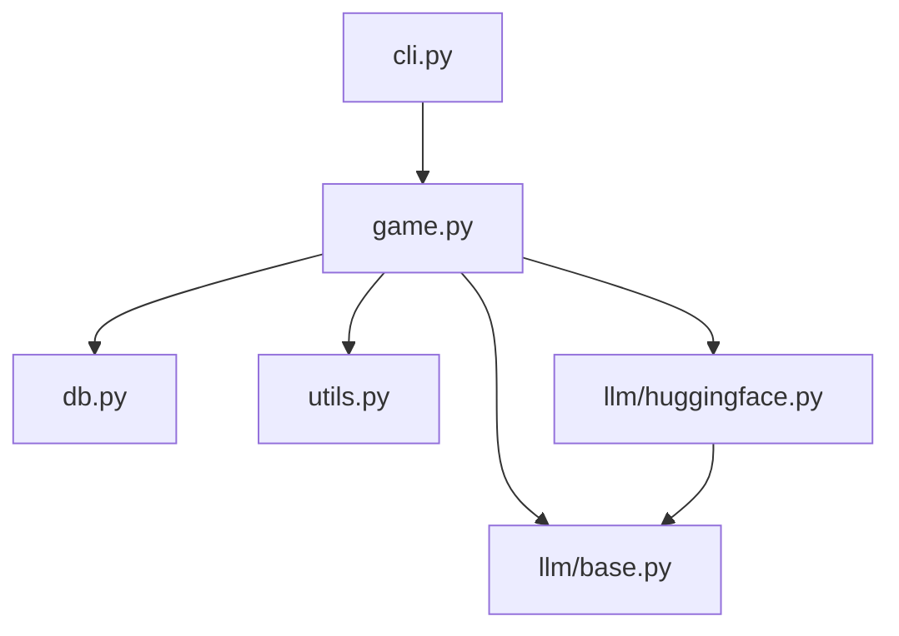

# LexiChess

LexiChess is a Python-based system that orchestrates chess matches between large language models (LLMs), records games, tracks conversations, and logs hallucinations (invalid moves). The system uses the `python-chess` library for chess mechanics and `SQLite` for storing game and conversation data. It currently ships with an interface for running local HuggingFace models via `transformers` but is designed so that additional LLM backends can be added easily.

## Features

- Play chess games between two LLMs
- Record moves, conversations and hallucinations in an SQLite database
- Simple CLI for running matches
- Modular design for extending to other LLM providers

## Installation

Install the required dependencies using pip:

```bash
pip install python-chess transformers
```

## Usage

Run a match between two local HuggingFace models (defaults to `gpt2` for both sides):

```bash
python -m lexichess.cli --white-model gpt2 --black-model gpt2
```

The game record will be stored in `lexichess.db` in the current directory.

## Repository Structure

- `lexichess/` – core package
  - `llm/` – LLM integrations
  - `game.py` – orchestrates games between LLMs
  - `db.py` – SQLite database helper
  - `cli.py` – command line interface
- `README.md` – this file

## File Dependency Diagram



This project is structured for open-source collaboration and can be extended with new LLM backends or additional logging as needed.
