# LexiChess File Structure

This document describes the file structure of LexiChess, providing a detailed overview of directories and key files to help contributors navigate the codebase. The structure is modular, supporting features like LLM tournaments, tutoring, web UI, and API functionality.

## File Structure
```
lexichess/
├── /Notebooks/              # Instructional Jupyter notebooks for tutorials and research
│   ├── tournament.ipynb     # Guide to running LLM tournaments
│   ├── tutoring.ipynb       # Interactive chess lessons and tutoring examples
│   └── analysis.ipynb       # Analyze hallucination and tutoring data
├── /Sandbox/                # Development space for experiments and prototypes
│   ├── prototype_prompt.py  # Experimental LLM prompts
│   ├── test_api.py          # API endpoint prototypes
│   └── sandbox_README.md    # Guidelines for using the sandbox
├── /src/                    # Core Python backend code
│   ├── /chess/              # Chess logic and tournament management
│   │   ├── __init__.py      # Package initialization
│   │   ├── board.py         # Chess board and move validation using python-chess
│   │   ├── tournament.py    # LLM tournament orchestration and pairing
│   │   └── time_control.py  # Tournament time controls (e.g., 5+3)
│   ├── /llm/                # LLM integration
│   │   ├── __init__.py      # Package initialization
│   │   ├── api_client.py    # API-based LLMs (e.g., Grok, OpenAI)
│   │   ├── local_client.py  # Local LLMs (e.g., Ollama, LLaMA)
│   │   └── prompt.py        # Prompt engineering for moves and tutoring
│   ├── /tutoring/           # Tutoring logic
│   │   ├── __init__.py      # Package initialization
│   │   ├── curriculum.py    # Lesson plans and content (beginner to advanced)
│   │   ├── feedback.py      # Personalized feedback for tutoring
│   │   └── avatar.py        # Avatar interaction (text and voice)
│   ├── /api/                # API endpoints
│   │   ├── __init__.py      # Package initialization
│   │   ├── endpoints.py     # RESTful endpoints using Flask-RESTful
│   │   └── auth.py          # API authentication (OAuth2 or API keys)
│   ├── /database/           # SQLite database management
│   │   ├── __init__.py      # Package initialization
│   │   ├── schema.py        # Database schema for games, moves, lessons
│   │   └── queries.py       # Data access and logging functions
│   └── main.py              # Flask app entry point
├── /frontend/               # React frontend code
│   ├── /public/             # Static assets (e.g., images, favicon)
│   ├── /src/                # React components
│   │   ├── /components/     # UI components (e.g., board, chat, avatar)
│   │   ├── /pages/          # Pages (e.g., game, tutoring, dashboard)
│   │   └── /utils/          # WebSocket and API helpers
│   ├── package.json         # Node.js dependencies
│   └── vite.config.js       # Vite build configuration
├── /docs/                   # Documentation
│   ├── file_structure.md    # This file, detailing file structure
│   ├── /diagrams/           # Visual diagrams
│   │   └── file_structure.mmd  # Mermaid diagram source
│   ├── api.md               # API documentation (Phase 5)
│   └── tutoring.md          # Tutoring curriculum guide
├── /tests/                  # Unit and integration tests
│   ├── /chess/              # Tests for chess logic
│   ├── /llm/                # Tests for LLM integration
│   ├── /tutoring/           # Tests for tutoring
│   └── /api/                # Tests for API endpoints
├── /scripts/                # Utility scripts
│   ├── setup_db.py          # Initialize SQLite database
│   └── run_tournament.py    # Run sample tournament
├── README.md                # Project overview and basic file structure
├── CONTRIBUTING.md          # Contribution guidelines
├── LICENSE                  # MIT license
├── pyproject.toml           # Python dependencies (Poetry)
└── .gitignore               # Git ignore rules
```

## Visual Diagram
The following Mermaid diagram visualizes the file structure, rendered on GitHub for clarity.

```mermaid
graph TD
    A[lexichess/] --> K[Notebooks/]
    A --> L[Sandbox/]
    A --> B[src/]
    A --> C[frontend/]
    A --> D[docs/]
    A --> E[tests/]
    A --> F[scripts/]
    A --> G[README.md]
    A --> H[CONTRIBUTING.md]
    A --> I[LICENSE]
    A --> J[pyproject.toml]

    K --> K1[tournament.ipynb]
    K --> K2[tutoring.ipynb]
    K --> K3[analysis.ipynb]

    L --> L1[prototype_prompt.py]
    L --> L2[test_api.py]
    L --> L3[sandbox_README.md]

    B --> B1[chess/]
    B --> B2[llm/]
    B --> B3[tutoring/]
    B --> B4[api/]
    B --> B5[database/]
    B --> B6[main.py]

    B1 --> B1a[board.py]
    B1 --> B1b[tournament.py]
    B1 --> B1c[time_control.py]

    B2 --> B2a[api_client.py]
    B2 --> B2b[local_client.py]
    B2 --> B2c[prompt.py]

    B3 --> B3a[curriculum.py]
    B3 --> B3b[feedback.py]
    B3 --> B3c[avatar.py]

    B4 --> B4a[endpoints.py]
    B4 --> B4b[auth.py]

    B5 --> B5a[schema.py]
    B5 --> B5b[queries.py]

    C --> C1[public/]
    C --> C2[src/]
    C --> C3[package.json]
    C --> C4[vite.config.js]

    C2 --> C2a[components/]
    C2 --> C2b[pages/]
    C2 --> C2c[utils/]

    D --> D1[file_structure.md]
    D --> D2[diagrams/]
    D --> D3[api.md]
    D --> D4[tutoring.md]

    D2 --> D2a[file_structure.mmd]

    E --> E1[chess/]
    E --> E2[llm/]
    E --> E3[tutoring/]
    E --> E4[api/]

    F --> F1[setup_db.py]
    F --> F2[run_tournament.py]
```

